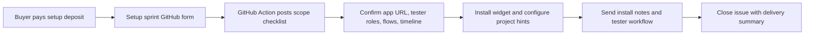
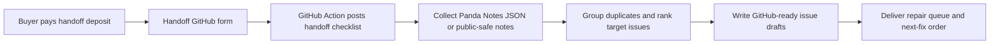
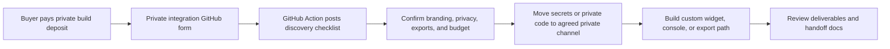

# Panda Notes

Standalone local-first feedback console for developers, alpha testers, and beta testers.

Panda Notes started as the CueForge right-click note loop. This repo splits it into its own app so it can be used by any project that needs tester feedback tied to developer repair work.

Live app: <https://p4nd4907.github.io/panda-notes/>

Widget demo: <https://p4nd4907.github.io/panda-notes/widget-demo.html>

Paid services: <https://p4nd4907.github.io/panda-notes/services.html>

## Focus

- Developers select target issues, inspect tester evidence, review mapped code snippets, and export a repair packet.
- Alpha testers capture rough edges early: broken controls, confusing copy, cramped layout, missing states, slow paths, and ideas.
- Beta testers prove repeat issues from real sessions so teams know what to fix next.

## What It Does Now

- Role quick starts for developers, alpha testers, and beta testers.
- Local tester note capture with page, target, component, viewport, exact right-click point, tag, and redacted note text.
- Target issue repair queue grouped by page, target, and tag.
- Search, tag, and evidence-role filters for narrowing the repair queue.
- Code snippet popout for the selected target issue.
- GitHub-ready issue draft copy/export with tester evidence, labels, target code, and test plan.
- Repair prompt copy/export for handing a selected issue to Codex, ChatGPT, or another code assistant without adding secrets to the widget.
- Developer packet copy/export and JSON import/export for moving notes between browsers or projects.
- Alpha embeddable right-click widget at `/panda-notes-widget.js`.

## Can I Use It In My Project?

Yes. Panda Notes is MIT licensed, so teams may link to it, fork it, copy it, and adapt it for their own alpha/beta testing workflows as long as the license notice stays with the software.

Current integration:

- Link testers to the hosted console.
- Import/export Panda Notes JSON between projects or browsers.
- Copy developer packets and GitHub-ready issue drafts.
- Add the alpha right-click widget to a project with one script tag.

Alpha widget install:

```html
<script src="https://p4nd4907.github.io/panda-notes/panda-notes-widget.js"></script>
<script>
  PandaNotes.init({
    project: "my-app",
    role: "beta",
    mode: "local",
    contextMenu: true
  });
</script>
```

See [Embedding Panda Notes](docs/EMBEDDING.md) for the widget API, demo page, and markup hints.

## Monetization

Panda Notes is free and MIT licensed, with a practical path to paid setup/support:

- Free console and right-click widget for adoption.
- Paid setup sprints for teams that want it installed in staging/beta.
- Paid developer handoff packs for turning tester exports into repair queues.
- Optional private/white-label integrations later.

How the money works even though GitHub is free:

- The public repo is the trust builder and adoption path.
- The paid service sells time saved, setup support, cleaner repair queues, and private custom work.
- Teams can do it themselves for free, or pay when they want it handled faster and cleaner.

Live intake is set up through GitHub issue forms:

- [Setup sprint](https://github.com/P4ND4907/panda-notes/issues/new?template=setup-sprint.yml)
- [Developer handoff pack](https://github.com/P4ND4907/panda-notes/issues/new?template=developer-handoff-pack.yml)
- [Private integration](https://github.com/P4ND4907/panda-notes/issues/new?template=private-integration.yml)

See [Panda Notes Services](https://p4nd4907.github.io/panda-notes/services.html), [Monetization Plan](docs/MONETIZATION.md), [Competitive Comparison](docs/COMPETITIVE_COMPARISON.md), and [Analytics Taxonomy](docs/ANALYTICS.md).

Stripe Payment Links are wired through `public/stripe-links.json`. Create or paste the three deposit links, then the Services page will send buyers to Stripe-hosted checkout. See [Stripe Setup](docs/STRIPE.md).

## Service Flows

Panda Notes uses a lightweight public intake path: Stripe Payment Links collect deposits, GitHub issue forms collect public-safe scope, and GitHub Actions add the repeatable request checklist.

More detail: [Service Operations](docs/SERVICE_OPERATIONS.md).

### Setup Sprint



### Developer Handoff Pack



### Private Integration



## Workflow

1. Pick a role in the sidebar.
2. Capture notes as testers find broken, confusing, slow, missing, or cramped UI.
3. Filter the target issue list by search text, tag, or evidence role.
4. Select an issue to review evidence and mapped code.
5. Copy the GitHub issue draft or export the developer packet.

## Local

```powershell
npm.cmd install
npm.cmd run dev
```

## Verify

```powershell
npm.cmd test
npm.cmd run build
```

## Stripe Links

```powershell
npm.cmd run stripe:links:secure
```

That command uses a hidden PowerShell prompt so the Stripe secret key is not posted, printed, or committed. It writes only public Stripe Payment Link URLs into `public/stripe-links.json`.

## Privacy Boundary

No hidden telemetry. Notes stay in local browser storage until someone explicitly exports JSON or copies/downloads a developer packet.

## License

MIT. See [LICENSE](LICENSE).
