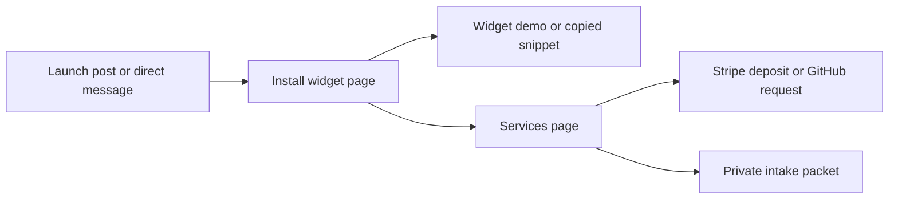

# Panda Notes Promotion Sprint

Goal: get developers, beta founders, small agencies, and QA-heavy product teams onto the install page, then convert the teams that need help into setup or handoff leads.

Primary funnel:



## This Week

| Day | Ship | Where | CTA | Check |
| --- | --- | --- | --- | --- |
| 1 | v0.3 GitHub pre-release | GitHub releases | Install widget | `npm.cmd run analytics:summary -- 1` |
| 1 | Short launch post | X, Threads, LinkedIn, personal Discord if allowed | Install widget | Install page views |
| 2 | Builder post | Indie Hackers, Hacker News if appropriate, dev communities that allow launches | Feedback on install flow | Comments and stars |
| 3 | Community feedback ask | Relevant beta/testing/dev groups | Try widget demo | Demo clicks |
| 4 | 30-second demo clip | X, LinkedIn, Reddit only where allowed | Watch then install | Replies |
| 5 | Five direct messages | Teams visibly running beta/staging/QA | Setup sprint | Replies |
| 6 | Before/after cleanup example | Social + README screenshot thread | Handoff pack | Saves/shares |
| 7 | Analytics review | Local CLI | Double down | CTA/deposit clicks |

## Daily Command

```powershell
npm.cmd run analytics:summary -- 7
```

## What Counts

- `install` page views mean promotion reached the right first step.
- `install_snippet_copy` means someone may be trying the widget.
- `cta_primary_click` from the install page means setup-sprint buying intent.
- `deposit_click` means Stripe checkout intent.
- `private_intake_submit_success` means a real lead should be handled quickly.

## No-Spam Boundary

Post where launches, dev tools, beta testing, QA, or indie builder feedback are welcome. Do not mass-post the same copy into unrelated groups. Lead with the problem and ask for feedback first; mention paid help only when the person or community is already talking about setup, tester exports, handoff, or cleanup.
