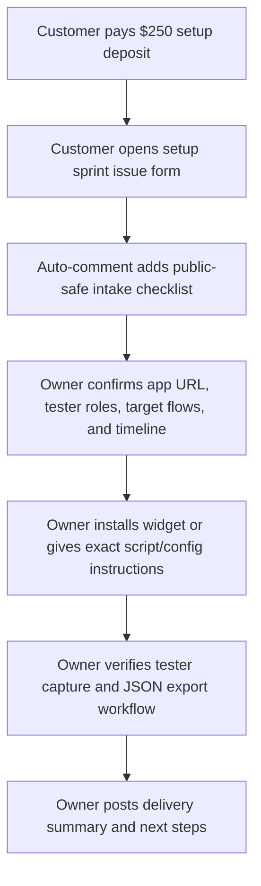
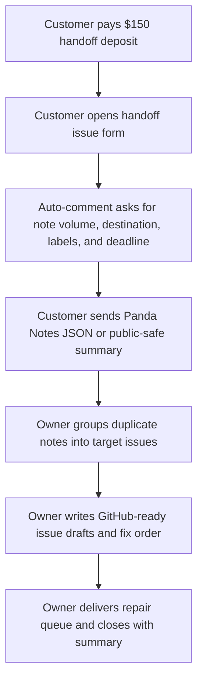
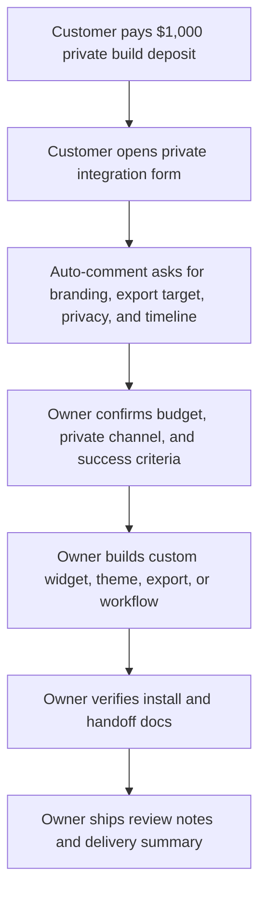

# Panda Notes Service Workflows

This document explains how paid Panda Notes requests move from checkout to delivery while keeping the public issue tracker free of secrets and private customer data.

## Service Stack

- Stripe Payment Links collect deposits before work starts.
- GitHub issue forms capture public-safe service scope in a structured format.
- GitHub Actions post the repeatable checklist as soon as a paid service issue opens.
- GitHub labels show request state: scope needed, payment confirmed, waiting on customer, in progress, or delivered.
- The Panda Notes Services page explains offers and answers common questions before a customer opens a request.

The free repo helps people evaluate and adopt Panda Notes. The paid service sells saved time, setup help, clean developer handoffs, and private integration work.

## Request Workflow

1. Check Stripe for new deposits.
2. Review new `paid-service` issues.
3. Confirm the customer picked the right service and did not post secrets.
4. Reply with the next action: scope confirmation, private channel, export request, or delivery date.
5. Move the issue through labels such as `scope-needed`, `in-progress`, `waiting-on-customer`, and `delivered`.
6. Close the issue with a short delivery summary and links to public-safe deliverables.

## Setup Sprint Flow

Delivery checklist:

- Confirm payment before starting work.
- Confirm whether the app URL is public, staging, or private.
- Ask for a private channel before receiving credentials, tokens, or private code.
- Deliver widget install notes, tester workflow, and a small developer handoff checklist.

## Developer Handoff Pack Flow

Delivery checklist:

- Confirm note volume before promising turnaround.
- Redact private user data before creating issue drafts.
- Group duplicate notes by page, target, component, tag, and tester role.
- Deliver fix order, labels, issue drafts, and test-plan notes.

## Private Integration Flow

Delivery checklist:

- Confirm deposit, budget range, and whether the work needs a private repo.
- Keep customer secrets out of public GitHub issues.
- Define the exact custom output: branded widget, white-label console, export format, screenshot/DOM hook, or support pack.
- Deliver setup docs and maintenance notes.

## Labels To Use

- `paid-service`: every paid lead.
- `scope-needed`: waiting on final service scope.
- `payment-confirmed`: deposit is confirmed.
- `waiting-on-customer`: blocked on customer info or files.
- `in-progress`: work has started.
- `delivered`: handoff has been sent.

## Customer Message Template

Thanks for opening a Panda Notes service request. Panda Notes keeps public GitHub issues free of secrets and private customer data.

Next, please confirm:

- Which service you want.
- Whether the deposit is paid or you need the Stripe link.
- Public-safe app URL or repo link, if shareable.
- Target deadline.
- Whether any private details need to move to a private channel.

Once scope and deposit are confirmed, the request gets a delivery date and the exact handoff you will receive.
